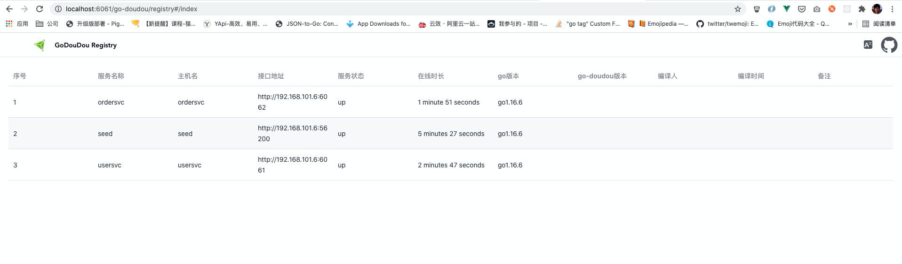
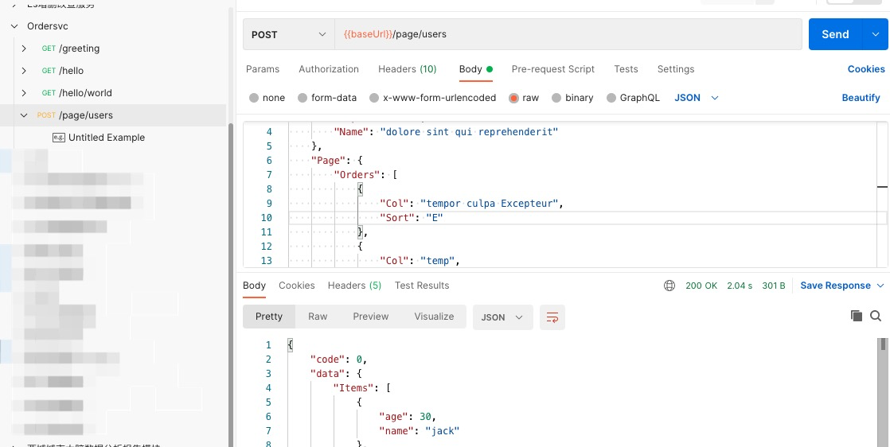
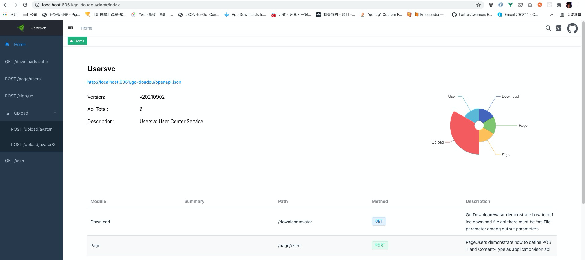
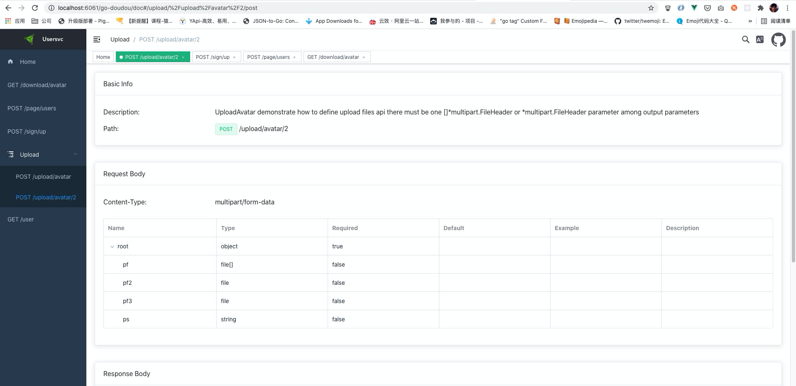

## go-doudou-guide

This is a demo project for showing how go-doudou can help you.


### Step 0

Install go-doudou

```shell
go get -v github.com/unionj-cloud/go-doudou@v0.8.7
```


### Step 1

Clone this repository

```shell
git clone git@github.com:unionj-cloud/go-doudou-guide.git
```


### Step 2

Start seed service. In real project, it doesn't have to have a node dedicated to providing seed service, you can use any node providing any service in the cluster as seed.

```shell
cd seed && go run cmd/main.go
```

Then you should see

```
➜  go-doudou-guide git:(master) ✗ cd seed && go run cmd/main.go
INFO[2021-09-02 18:10:43] Node seed joined, supplying seed service     
WARN[2021-09-02 18:10:43] No seed found                                
INFO[2021-09-02 18:10:43] Memberlist created. Local node is Node seed, providing seed service at http://192.168.101.6:56200, memberlist port 56199 
 _____                     _                    _
|  __ \                   | |                  | |
| |  \/  ___   ______   __| |  ___   _   _   __| |  ___   _   _
| | __  / _ \ |______| / _` | / _ \ | | | | / _` | / _ \ | | | |
| |_\ \| (_) |        | (_| || (_) || |_| || (_| || (_) || |_| |
 \____/ \___/          \__,_| \___/  \__,_| \__,_| \___/  \__,_|
INFO[2021-09-02 18:10:43] ================ Registered Routes ================ 
INFO[2021-09-02 18:10:43] +-------------+--------+-------------------------+ 
INFO[2021-09-02 18:10:43] |    NAME     | METHOD |         PATTERN         | 
INFO[2021-09-02 18:10:43] +-------------+--------+-------------------------+ 
INFO[2021-09-02 18:10:43] | GetDoc      | GET    | /go-doudou/doc          | 
INFO[2021-09-02 18:10:43] | GetOpenAPI  | GET    | /go-doudou/openapi.json | 
INFO[2021-09-02 18:10:43] | Prometheus  | GET    | /go-doudou/prometheus   | 
INFO[2021-09-02 18:10:43] | GetRegistry | GET    | /go-doudou/registry     | 
INFO[2021-09-02 18:10:43] +-------------+--------+-------------------------+ 
INFO[2021-09-02 18:10:43] =================================================== 
INFO[2021-09-02 18:10:43] Started in 388.559µs                         
INFO[2021-09-02 18:10:43] Http server is listening on :56200 
```


### Step 3

Open another terminal tab and start usersvc service. 

```shell
cd usersvc && go run cmd/main.go
```

Then you shoud see

```
➜  go-doudou-guide git:(master) ✗ cd usersvc && go run cmd/main.go
INFO[2021-09-02 18:13:22] Node usersvc joined, supplying usersvc service 
INFO[2021-09-02 18:13:22] 2021/09/02 18:13:22 [DEBUG] memberlist: Initiating push/pull sync with:  [::1]:56199 
INFO[2021-09-02 18:13:22] Node seed joined, supplying seed service     
INFO[2021-09-02 18:13:22] Node {192.168.101.6:65352 usersvc} joined cluster successfully 
INFO[2021-09-02 18:13:22] Memberlist created. Local node is Node usersvc, providing usersvc service at http://192.168.101.6:6061, memberlist port 65352 
 _____                     _                    _
|  __ \                   | |                  | |
| |  \/  ___   ______   __| |  ___   _   _   __| |  ___   _   _
| | __  / _ \ |______| / _` | / _ \ | | | | / _` | / _ \ | | | |
| |_\ \| (_) |        | (_| || (_) || |_| || (_| || (_) || |_| |
 \____/ \___/          \__,_| \___/  \__,_| \__,_| \___/  \__,_|
INFO[2021-09-02 18:13:22] ================ Registered Routes ================ 
INFO[2021-09-02 18:13:22] +----------------+--------+-------------------------+ 
INFO[2021-09-02 18:13:22] |      NAME      | METHOD |         PATTERN         | 
INFO[2021-09-02 18:13:22] +----------------+--------+-------------------------+ 
INFO[2021-09-02 18:13:22] | PageUsers      | POST   | /page/users             | 
INFO[2021-09-02 18:13:22] | User           | GET    | /user                   | 
INFO[2021-09-02 18:13:22] | SignUp         | POST   | /sign/up                | 
INFO[2021-09-02 18:13:22] | UploadAvatar   | POST   | /upload/avatar          | 
INFO[2021-09-02 18:13:22] | UploadAvatar2  | POST   | /upload/avatar/2        | 
INFO[2021-09-02 18:13:22] | DownloadAvatar | GET    | /download/avatar        | 
INFO[2021-09-02 18:13:22] | GetDoc         | GET    | /go-doudou/doc          | 
INFO[2021-09-02 18:13:22] | GetOpenAPI     | GET    | /go-doudou/openapi.json | 
INFO[2021-09-02 18:13:22] | Prometheus     | GET    | /go-doudou/prometheus   | 
INFO[2021-09-02 18:13:22] | GetRegistry    | GET    | /go-doudou/registry     | 
INFO[2021-09-02 18:13:22] +----------------+--------+-------------------------+ 
INFO[2021-09-02 18:13:22] =================================================== 
INFO[2021-09-02 18:13:22] Started in 612.846µs                         
INFO[2021-09-02 18:13:22] Http server is listening on :6061            
INFO[2021-09-02 18:13:23] 2021/09/02 18:13:23 [DEBUG] memberlist: Stream connection from=192.168.101.6:53776 
INFO[2021-09-02 18:13:28] 2021/09/02 18:13:28 [DEBUG] memberlist: Stream connection from=192.168.101.6:53797 
INFO[2021-09-02 18:13:30] 2021/09/02 18:13:30 [DEBUG] memberlist: Initiating push/pull sync with: seed 192.168.101.6:56199 
INFO[2021-09-02 18:13:33] 2021/09/02 18:13:33 [DEBUG] memberlist: Stream connection from=192.168.101.6:53819 
INFO[2021-09-02 18:13:35] 2021/09/02 18:13:35 [DEBUG] memberlist: Initiating push/pull sync with: seed 192.168.101.6:56199 
INFO[2021-09-02 18:13:38] 2021/09/02 18:13:38 [DEBUG] memberlist: Stream connection from=192.168.101.6:53841 
INFO[2021-09-02 18:13:40] 2021/09/02 18:13:40 [DEBUG] memberlist: Initiating push/pull sync with: seed 192.168.101.6:56199 
INFO[2021-09-02 18:13:43] 2021/09/02 18:13:43 [DEBUG] memberlist: Stream connection from=192.168.101.6:53863 
```


### Step 4

Open another terminal tab and start ordersvc service. It is dependent on usersvc service for fetching user data.

```shell
cd ordersvc && go run cmd/main.go
```

Then you should see

```
➜  go-doudou-guide git:(master) ✗ cd ordersvc && go run cmd/main.go
INFO[2021-09-02 18:14:19] Node ordersvc joined, supplying ordersvc service 
INFO[2021-09-02 18:14:19] 2021/09/02 18:14:19 [DEBUG] memberlist: Initiating push/pull sync with:  [::1]:56199 
INFO[2021-09-02 18:14:19] Node usersvc joined, supplying usersvc service 
INFO[2021-09-02 18:14:19] Node seed joined, supplying seed service     
INFO[2021-09-02 18:14:19] Node {192.168.101.6:61122 ordersvc} joined cluster successfully 
INFO[2021-09-02 18:14:19] Node ordersvc, providing ordersvc service at http://192.168.101.6:6062, memberlist port 61122 joined cluster 
 _____                     _                    _
|  __ \                   | |                  | |
| |  \/  ___   ______   __| |  ___   _   _   __| |  ___   _   _
| | __  / _ \ |______| / _` | / _ \ | | | | / _` | / _ \ | | | |
| |_\ \| (_) |        | (_| || (_) || |_| || (_| || (_) || |_| |
 \____/ \___/          \__,_| \___/  \__,_| \__,_| \___/  \__,_|
INFO[2021-09-02 18:14:19] ================ Registered Routes ================ 
INFO[2021-09-02 18:14:19] +-------------+--------+-------------------------+ 
INFO[2021-09-02 18:14:19] |    NAME     | METHOD |         PATTERN         | 
INFO[2021-09-02 18:14:19] +-------------+--------+-------------------------+ 
INFO[2021-09-02 18:14:19] | PageUsers   | POST   | /page/users             | 
INFO[2021-09-02 18:14:19] | Hello       | GET    | /hello                  | 
INFO[2021-09-02 18:14:19] | Greeting    | GET    | /greeting               | 
INFO[2021-09-02 18:14:19] | HelloWorld  | GET    | /hello/world            | 
INFO[2021-09-02 18:14:19] | GetDoc      | GET    | /go-doudou/doc          | 
INFO[2021-09-02 18:14:19] | GetOpenAPI  | GET    | /go-doudou/openapi.json | 
INFO[2021-09-02 18:14:19] | Prometheus  | GET    | /go-doudou/prometheus   | 
INFO[2021-09-02 18:14:19] | GetRegistry | GET    | /go-doudou/registry     | 
INFO[2021-09-02 18:14:19] +-------------+--------+-------------------------+ 
INFO[2021-09-02 18:14:19] =================================================== 
INFO[2021-09-02 18:14:19] Started in 843.066µs                         
INFO[2021-09-02 18:14:19] Http server is listening on :6062            
INFO[2021-09-02 18:14:23] 2021/09/02 18:14:23 [DEBUG] memberlist: Stream connection from=192.168.101.6:54043 
INFO[2021-09-02 18:14:26] 2021/09/02 18:14:26 [DEBUG] memberlist: Stream connection from=192.168.101.6:54052 
INFO[2021-09-02 18:14:28] 2021/09/02 18:14:28 [DEBUG] memberlist: Initiating push/pull sync with: usersvc 192.168.101.6:65352 
INFO[2021-09-02 18:14:28] 2021/09/02 18:14:28 [DEBUG] memberlist: Stream connection from=192.168.101.6:54066 
INFO[2021-09-02 18:14:33] 2021/09/02 18:14:33 [DEBUG] memberlist: Initiating push/pull sync with: seed 192.168.101.6:56199 
INFO[2021-09-02 18:14:33] 2021/09/02 18:14:33 [DEBUG] memberlist: Stream connection from=192.168.101.6:54089 
INFO[2021-09-02 18:14:38] 2021/09/02 18:14:38 [DEBUG] memberlist: Initiating push/pull sync with: usersvc 192.168.101.6:65352 
```


### Step 5

Now you can check what services registered in the cluster from browser.




### Step 6

Import ordersvc_openapi3.json file in ordersvc folder into postman and try /page/users api.

Don't forget set baseUrl to http://localhost:6062.



Or you can use curl.

```
curl --location --request POST 'http://localhost:6062/page/users' \
--header 'Content-Type: application/json' \
--data-raw '{
    "Filter": {
        "Dept": 9261131,
        "Name": "dolore sint qui reprehenderit"
    },
    "Page": {
        "Orders": [
            {
                "Col": "tempor culpa Excepteur",
                "Sort": "E"
            },
            {
                "Col": "temp",
                "Sort": "proident do nostrud"
            }
        ],
        "PageNo": 71167290,
        "Size": 48190708
    }
}'
```

You can see ordersvc send a request to usersvc to get data and then send response to user.


### Step 7

Let's see what apis that usersvc service is providing for us.

```go
package service

import (
	"context"
	v3 "github.com/unionj-cloud/go-doudou/openapi/v3"
	"os"
	"usersvc/vo"
)

// Usersvc User Center Service
type Usersvc interface {
	// PageUsers demonstrate how to define POST and Content-Type as application/json api
	PageUsers(ctx context.Context,
	// comments above input and output struct type parameters in vo package will display on online document
	// not comments here
		query vo.PageQuery) (
	// it indicates there is an error if code is not 0
		code int,
	// page data
		data vo.PageRet,
	// error message
		msg error)

	// GetUser demonstrate how to define GET api with query string parameters
	GetUser(ctx context.Context,
	// user id
	// comments above input and output basic type parameters will display on online document
		userId string, photo string) (code int, data string, msg error)

	// SignUp demonstrate how to define POST and Content-Type as application/x-www-form-urlencoded api
	SignUp(ctx context.Context, username string, password int, actived bool, score float64) (code int, data string, msg error)

	// UploadAvatar demonstrate how to define upload files api
	// there must be one []*v3.FileModel or *v3.FileModel parameter among input parameters
	// remember to close the readers by Close method of v3.FileModel if you don't need them anymore when you finished your own business logic
	UploadAvatar(context.Context, []*v3.FileModel, string) (int, string, error)

	// UploadAvatar2 demonstrate how to define upload files api
	// remember to close the readers by Close method of v3.FileModel if you don't need them anymore when you finished your own business logic
	UploadAvatar2(context.Context, []*v3.FileModel, string, *v3.FileModel, *v3.FileModel) (int, string, error)

	// GetDownloadAvatar demonstrate how to define download file api
	// there must be *os.File parameter among output parameters
	GetDownloadAvatar(ctx context.Context, userId string) (
	// mimetype(Content-Type) for download file
	// you don't have to add this parameter because you will have a default value application/octet-stream
	// in generated handlerimpl.go file.
	// if you add it, you should make a small fix manually to replace application/octet-stream with it.
	// Any custom manual fix in handlerimpl.go file won't been overwritten when you re-execute go-doudou commands
	// like go-doudou svc http --handler -c go --doc
	// go-doudou will ignore any output parameter other than *os.File when generate OpenAPI 3.0 json file and online document
		string,
	// download file
		*os.File, error)
}
```

Also you can import usersvc_openapi3.json file in usersvc folder into postman to have a try.

Also you can have a look the document from browser.






### Docker Compose
You can execute below command to start the whole services and jaeger
```shell
docker-compose -f docker-compose.yml up -d 
```


### TODO

More documentation and tutorials will coming soon... 

